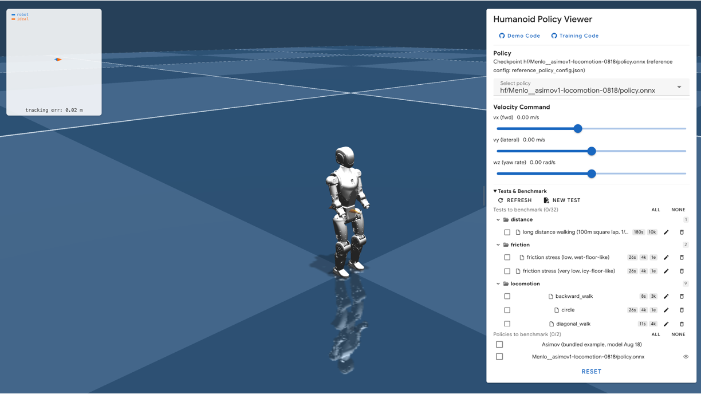

# Humanoid Policy Viewer



A browser-based viewer and test bench for humanoid locomotion policies. It runs
a MuJoCo WebAssembly simulation of the [Asimov](https://github.com/menloresearch/asimov-1)
robot and drives it with an ONNX policy through onnxruntime-web, so a trained
policy can be tried without a GPU or a training stack.

- **Try a policy:** load one from Hugging Face with a single command, from a
  local model library, or use the bundled example.
- **Drive and stress it:** set velocity commands, push the robot, and change
  friction, armature, gains, gravity and other physical parameters live.
- **Score it:** `npm run benchmark <model>` runs a benchmark suite (locomotion,
  pushes, friction, long walks) published as a Hugging Face dataset, and posts
  the results to the model's `.eval_results/` for the Hub leaderboards.
- **Faithful setup:** the robot is the canonical `asimov-1` model, and each
  policy's gains, action scale and torque limits are read from its training
  `env.yaml`, so what you see matches how it was trained.

To train your own policy, use [cyclotron](https://github.com/menloresearch/cyclotron).
See [Supported policies](docs/huggingface.md#supported-policies) for the
inputs and outputs the viewer expects.

## Quick start

Run a policy from Hugging Face use the format `npm run hf <model>`

For Example:
```bash
npm run hf Menlo/asimov1-locomotion-0818
```

`<model>` is the Hugging Face repo id (`org/name`) or its URL. This works straight
from a fresh clone: it installs dependencies, fetches the Asimov robot model,
downloads the policy and opens the viewer with it selected. It needs Node, `git`
and `bash`. See [Run a policy from Hugging Face](docs/huggingface.md).

`<model>` can also be a folder or `.onnx` file on disk holding the same files,
for example `npm run hf ./my-policy`; see
[Run a policy from a folder](docs/huggingface.md#run-a-policy-from-a-folder).

## Run local policies

To run policies you have on disk, or to work on the viewer itself, set up once:

```bash
./scripts/init-asimov-1.sh   # fetch the Asimov robot model (sim-model/ only)
npm ci                       # install dependencies exactly as locked
npm run dev                  # start the viewer on the bundled example policy
```

Then open the printed URL. To add your own policy, put it in a folder under
`models/` (git-ignored, and not built into `dist/`):

```
models/my-policy/
├── policy.onnx
├── env.yaml       the training run's gains, action scale and torque limits
└── agent.yaml
```

It appears in the policy dropdown the next time the page loads. To serve
checkpoints from somewhere else, see [Model library](docs/model-library.md).

`npm run dev` listens on all network interfaces (it runs `vite --host`), so other
machines on your network can reach it. Run `npx vite` instead to keep it on
localhost, which is how `npm run hf` starts.

## Where policies come from

Every policy the viewer can run appears in its policy dropdown. There are three
sources:

| Source | Where the files are | How you get it |
|---|---|---|
| Bundled example | `public/examples/checkpoints/asimov/model_aug_18_1/`, in this repo | The default with `npm run dev` |
| Hugging Face | `~/.cache/humanoid-policy-viewer/hf/<org>__<name>/`, outside the repo | `npm run hf <model>` |
| Local folder | `models/<name>/` in this repo (git-ignored), or wherever `HPV_MODEL_LIBRARY_DIR` and `HPV_MODEL_ROOTS` point | Put the files there, then `npm run dev` |
| Any folder on disk | Wherever it is; linked, not copied | `npm run hf <folder>` |

In every case the gains, action scale and torque limits come from the `env.yaml`
next to the `.onnx`; see [Policy config](docs/policy-config.md). The robot is the
same everywhere: the `asimov-1` submodule.

## Docs

| Topic | |
|---|---|
| [Run a policy from Hugging Face](docs/huggingface.md) | `npm run hf`: options, private repos, where downloads are cached |
| [Policy config](docs/policy-config.md) | What `reference_policy_config.json` and a checkpoint's `env.yaml` each control, and which wins |
| [Model library](docs/model-library.md) | Serving checkpoints from outside `public/` (`HPV_MODEL_*` variables) |
| [Benchmarking](docs/benchmarking.md) | `npm run benchmark`: running a suite, what gets uploaded, versions, parallelism |
| [Benchmark datasets](docs/benchmark-datasets.md) | The suite format on the Hub, and `npm run suite` for creating, changing and releasing one |
| [Adding a robot](docs/adding-a-robot.md) | Bringing your own MJCF, policy and motion clips |
| [Benchmark methodology](benchmark/METHODOLOGY.md) | How the test suite and its thresholds were chosen |
| [Scenes](public/examples/scenes/README.md) | The `asimov-1` submodule and how actuators are added at load |

## Project structure

- `src/views/Demo.vue` - UI controls for the live demo
- `src/simulation/main.js` - bootstraps MuJoCo, Three.js renderer, policy loop, and metric sampling hook
- `src/simulation/mujocoUtils.js` - scene/policy loading utilities and filesystem preloading
- `src/simulation/policyRunner.js` - ONNX inference wrapper and observation pipeline
- `public/examples/scenes/` - MJCF files + meshes staged into MuJoCo's MEMFS; the Asimov robot is the `asimov-1/` git submodule
- `public/examples/checkpoints/` - policy config JSON, bundled ONNX files, and motion clips
- `scripts/` - `npm run hf`, `npm run benchmark`, `npm run suite`, and dev-server helpers
- `src/benchmark/` - benchmark protocol, test-row and suite formats, scoring
- `benchmark/` - the original test definitions, to be moved into the benchmark dataset (`npm run suite init`)
- `test/fixtures/smoke-suite/` - a tiny benchmark suite for tests and the golden check
- an optional [model library](docs/model-library.md) served by local Vite middleware under `/model-library/`

## License and acknowledgements

This repository is a fork of `humanoid-policy-viewer` by
[Qingzhou Lu (Axellwppr)](https://github.com/Axellwppr), a motion-tracking viewer for the Unitree G1, and still carries that viewer's G1
scene and motion-tracking code. The upstream project's demos:
[Humanoid Policy Viewer](https://motion-tracking.axell.top/),
[GentleHumanoid Web Demo](https://gentle-humanoid.axell.top/).

Both the original project and Menlo Research's additions are licensed under the
[BSD 3-Clause License](LICENSE):

- **Original code**, author-created motions, and the author-trained policy
  weights at `public/examples/checkpoints/g1/policy_latest.onnx` — copyright
  © 2026 Qingzhou Lu.
- **Menlo Research modifications** — changes made after upstream commit
  `0490320`, including Asimov support, the benchmark suite, and Hugging Face
  model loading — copyright © 2026 Menlo Research Pte. Ltd.

Third-party code, libraries, robot descriptions, meshes, and third-party motion
data are not relicensed by this grant. They remain subject to their respective
terms; see [Third-party notices](THIRD_PARTY_NOTICES.md) for sources and scope.
This includes the Asimov robot description in the `asimov-1` submodule, which is
licensed under CERN-OHL-S-2.0.

This viewer builds on MuJoCo, the MuJoCo WASM community, Three.js, ONNX Runtime,
Vue, and Vuetify. We also thank Unitree Robotics and the creators of the motion
datasets used in the examples. If you build on this viewer, a link back to this
repository is appreciated.
